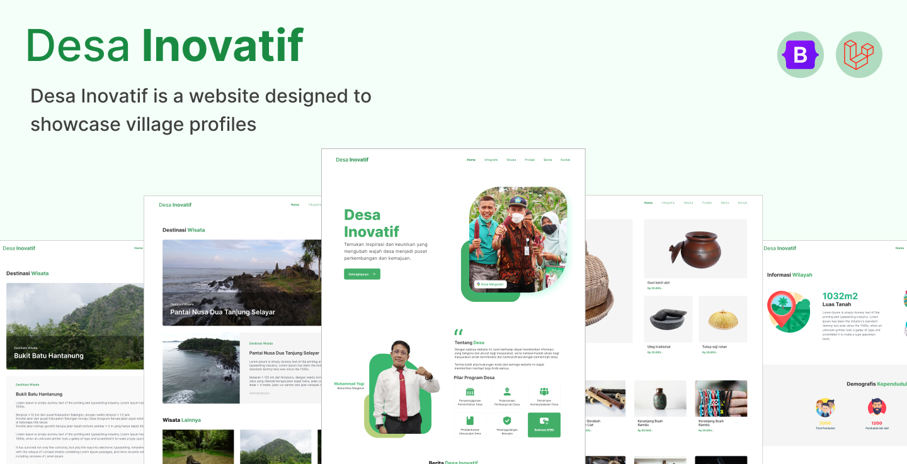

# Desa Inovatif
"Desa Inovatif is a website designed to showcase village profiles with a range of features suitable for use by villages. It is free and open-source!"

# [](#desa-inovatif)


### Made By [Digitaliz Yayasan Hasnur Centre](https://www.digitaliz.net/)


## What can you do in this website
- Super Admin has the capability to add Village Data along with domains and accounts for Village Admins, which fully supports multi-tenancy.
- Village Admins can manage Articles, Village Products, Village Tourism, Messages for users, and Village Infographics.


## Dependencies
- [Laravel v10.x](https://laravel.com/docs/10.x)
- [Bootstap v5.3](https://getbootstrap.com/docs/5.3/getting-started/introduction/)
- [Admin Kit v3.4.0](https://github.com/adminkit/adminkit) 
- [Font Awesome v5.7.2](https://fontawesome.com/docs/web/setup/get-started)
- [JQuery v3.6.0^](https://releases.jquery.com/)

## Requirements
- PHP v7.4^
- Node v16.16.0^


## Steps to Install
### Clone The GitHub Repo first
1. Open Cmd in folder you want to install project in...
2. Type below Command and hit enter...
```bash
git clone https://github.com/digitalizyhc/desainovatif.git
```
3. Then cd into folder using below Command
```bash
cd desainovatif
```
> Note from here On, You can also use Terminal from VS Code or Your IDE...

### Install All Composer Dependencies
1. Use below command to install all dependencies then wait till all process is complete...
```bash
composer install
```


### Create a .env file
1. Duplicate *.env.example* as *.env* file
2. Fill information of your DB **username** and **password** & other info if needed...
3. Fill **APP_URL** with your site link
```bash
APP_NAME=Desainovatif
APP_ENV=local
APP_KEY=
APP_DEBUG=true
APP_URL=http://localhost
```
4. Create generate AppKey by using below Command
```bash
php artisan key:generate
```
<!-- env code -->

> Note if you are using VS Code or any other IDE, then you can use their terminal to run commands, but make sure you are in project folder...

### Set APP_CENTRAL_DOMAIN in .env file
1. Set APP_CENTRAL_DOMAIN in .env file to your domain name
<!-- env code -->
```bash
APP_CENTRAL_DOMAIN=localhost
```
> Note this is used to set multytenance domain, so that you can login from any subdomain of your domain


### Create DataBase
1. Create DataBase by PhpMyadmin or Any Other DB you use...
> Note DataBase name should be same as typed in *.env* file
### DataBase Structure

1. Use below Command and wait till all migrations complete...
```bash
php artisan migrate
```
2. Use below Command to Link Storage to Public folder
```bash
php artisan storage:link
```

### Seed DataBase
1. Use below Command to seed DataBase
```bash
php artisan db:seed
```
> Note this will create Admin User with Email: admin@admin.com
> and Password: password with super admin role, 

>this will also create provinces, regencies and villages seeders, so you can use them in your project...

<!-- install NPM -->
### Install NPM
1. Use below Command to install NPM
```bash
npm install
```
### Compile NPM
1. Use below Command to compile NPM
```bash
npm run dev
```


### Serve Project
1. Use below Command to run project...
```bash
php artisan serve
```

You can run your project  by going to [http://localhost:8000](http://localhost:8000) in your browser...
> it depends on your APP_CENTRAL_DOMAIN and APP_URL in .env file

Now you can manage your project by add some village data, and login use Village Administrator to Manage some data...


## Author

- Instagram : <a href="https://www.instagram.com/digitaliz_/"> Digitaliz</a>


## Contributing

Contributions, issues and feature requests is welcome.
- First thing first, you should have bit knowledge about NodeJS.
- Github Knowledge.
- Clone this Repository to your machine and change to `main` branch.
- Go to Cloned Folder.
- In cli/bash run `npm install` it will install dependency from `package.json`.
- After installation complets, run `npm run dev` and run php artisan serve
- Cool, Send urs changes in PR to `main` branch.

## License

Desa Inovatif is an open source project by [Digitaliz](https://www.digitaliz.net/) 